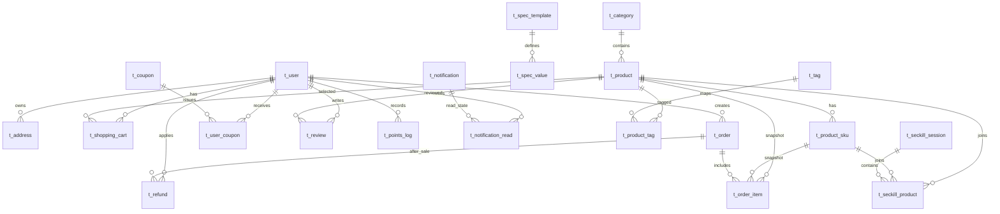

# 数据库设计文档

> 本文档按当前 `sql/schema.sql`、`sql/migrations/*` 和 `backend/app/models/models.py` 修订。

## 1. 数据库概述

| 项目 | 配置 |
|------|------|
| 数据库名 | `ecommerce_db` |
| 字符集 | `utf8mb4` |
| 排序规则 | `utf8mb4_unicode_ci` |
| 存储引擎 | `InnoDB` |
| 建议版本 | MySQL 8.0+ |

设计原则：

- 使用关系模型表达用户、商品、订单、优惠券、库存、评价、售后和通知等业务对象。
- 通过主键、外键、唯一键和业务索引保证数据完整性与查询效率。
- 订单相关表保存商品、地址、SKU 等快照，避免历史订单被后续资料变更污染。
- 通过 `stock` 与 `locked_stock` 区分真实库存和已被普通订单、秒杀活动占用的库存。
- 通过增量脚本维护从基础电商模型到标签、SKU、秒杀、通知、退货退款的演进过程。

## 2. 表结构清单

当前物理模型共 22 张主要业务表。

| 序号 | 表名 | 中文名 | 主要用途 |
|------|------|--------|----------|
| 1 | `t_user` | 用户表 | 普通用户、VIP 用户、管理员、余额和积分 |
| 2 | `t_category` | 分类表 | 多级商品分类 |
| 3 | `t_product` | 商品表 | 商品基础信息、价格、库存、兑换积分、多规格标识 |
| 4 | `t_address` | 地址表 | 用户收货地址 |
| 5 | `t_shopping_cart` | 购物车表 | 用户购物车，支持商品 SKU 维度 |
| 6 | `t_coupon` | 优惠券表 | 优惠券模板、门槛、数量、有效期 |
| 7 | `t_user_coupon` | 用户优惠券表 | 用户领取和使用优惠券的实例 |
| 8 | `t_order` | 订单表 | 订单主表、金额、状态、支付、物流和退货备注 |
| 9 | `t_order_item` | 订单明细表 | 商品购买快照，含 SKU 快照 |
| 10 | `t_review` | 评价表 | 商品评价、图片和管理员回复 |
| 11 | `t_points_log` | 积分流水表 | 积分收入、支出、余额和来源 |
| 12 | `t_operation_log` | 操作日志表 | 预留敏感操作审计 |
| 13 | `t_tag` | 商品标签表 | 标签字典 |
| 14 | `t_product_tag` | 商品标签关联表 | 商品与标签多对多关系 |
| 15 | `t_spec_template` | 规格模板表 | 规格维度，如颜色、尺寸、版本 |
| 16 | `t_spec_value` | 规格值表 | 规格模板下的可选值 |
| 17 | `t_product_sku` | 商品 SKU 表 | SKU 组合、价格、库存、图片和状态 |
| 18 | `t_seckill_session` | 秒杀场次表 | 秒杀活动时间窗口 |
| 19 | `t_seckill_product` | 秒杀商品表 | 活动商品、SKU、活动价、活动池库存和限购 |
| 20 | `t_notification` | 通知表 | 系统公告和个人消息 |
| 21 | `t_notification_read` | 公告已读表 | 系统公告的用户维度已读状态 |
| 22 | `t_refund` | 退货申请表 | 退货退款申请与审核记录 |

## 3. 核心关系设计



## 4. 关键表详细设计

### 4.1 `t_user`

用途：保存用户基础资料、登录凭据、会员身份、余额、积分和管理员标识。

关键字段：

| 字段 | 类型 | 说明 |
|------|------|------|
| `user_id` | INT PK | 用户 ID |
| `username` | VARCHAR(50) | 用户名 |
| `password` | VARCHAR(255) | BCrypt 密码摘要 |
| `phone` / `email` | VARCHAR | 手机号和邮箱，支持唯一约束 |
| `is_vip` / `vip_level` / `vip_expire_time` | TINYINT / DATETIME | VIP 状态、等级和到期时间 |
| `points` | INT | 积分余额 |
| `balance` | DECIMAL(10,2) | 系统余额 |
| `status` | TINYINT | 0 禁用，1 正常 |
| `is_admin` | TINYINT | 0 普通用户，1 管理员 |

索引重点：`username`、`phone`、`email`、`status`、`is_admin`、`create_time`。

### 4.2 `t_product`

用途：保存商品基础信息、价格、库存、营销标识和多规格状态。

关键字段：

| 字段 | 类型 | 说明 |
|------|------|------|
| `product_id` | INT PK | 商品 ID |
| `name` / `description` / `brand` | VARCHAR / TEXT | 商品展示信息 |
| `price` / `original_price` / `vip_price` | DECIMAL | 普通价、原价、会员价 |
| `stock` / `locked_stock` | INT | 实际库存和锁定库存 |
| `sold_count` | INT | 销量 |
| `category_id` | INT FK | 商品分类 |
| `main_image` / `sub_images` | VARCHAR / TEXT | 主图和子图 JSON |
| `status` | TINYINT | 0 下架，1 上架，2 删除 |
| `is_hot` / `is_new` / `is_recommend` | TINYINT | 商品标识 |
| `exchange_points` | INT | 积分兑换所需积分 |
| `has_sku` | TINYINT | 是否启用多规格 |

库存规则：

- 无 SKU 商品直接使用 `t_product.stock` 与 `t_product.locked_stock`。
- 有 SKU 商品的展示库存由 SKU 汇总，后台保存 SKU 时同步商品总库存。
- 秒杀活动添加商品时只增加锁定库存，不直接扣减真实库存；实际支付后再扣减。

### 4.3 `t_product_sku`

用途：表达商品不同规格组合的独立价格、库存、图片和上下架状态。

| 字段 | 类型 | 说明 |
|------|------|------|
| `sku_id` | INT PK | SKU ID |
| `product_id` | INT FK | 所属商品 |
| `spec_ids` | VARCHAR(500) | 规格值 ID 组合，JSON 数组 |
| `spec_text` | VARCHAR(200) | 规格展示文案 |
| `price` | DECIMAL(10,2) | SKU 价格，空值使用商品基础价 |
| `stock` / `locked_stock` | INT | SKU 实际库存和锁定库存 |
| `image` | VARCHAR(255) | SKU 图片 |
| `status` | TINYINT | 0 禁用，1 启用 |

### 4.4 `t_shopping_cart`

用途：保存用户购物车商品。当前唯一键为：

```sql
UNIQUE KEY uk_user_product_sku (user_id, product_id, sku_id)
```

该设计允许同一商品的不同 SKU 同时存在于购物车中，并使用 `sku_id = 0` 表示无规格商品，避免 MySQL 唯一键对 `NULL` 的特殊处理导致重复行。

### 4.5 `t_order` 与 `t_order_item`

`t_order` 保存订单主信息：

| 字段 | 说明 |
|------|------|
| `total_amount` | 商品总额 |
| `freight_amount` | 运费 |
| `discount_amount` | 优惠券抵扣金额 |
| `points_used` / `points_discount` | 使用积分和积分抵扣金额 |
| `payment_amount` | 应付金额 |
| `status` | 0 待支付、1 已支付、2 已发货、3 已完成、4 已取消、5 已退款、6 退货申请中 |
| `payment_method` | 1 支付宝占位、2 微信占位、3 银行卡占位、4 积分兑换、5 秒杀 |
| `address_snapshot` | 收货地址快照 JSON |
| `refund_reason` / `refund_remark` | 退货原因和管理员备注 |

`t_order_item` 保存商品购买快照：

| 字段 | 说明 |
|------|------|
| `product_id` | 商品 ID |
| `sku_id` | SKU ID，0 表示无规格 |
| `sku_text` | SKU 规格文案快照 |
| `product_name` / `product_image` | 下单时商品名称和图片快照 |
| `price` / `quantity` / `subtotal` | 成交单价、数量、小计 |
| `is_reviewed` | 是否已评价 |

### 4.6 `t_coupon` 与 `t_user_coupon`

优惠券模板与用户优惠券实例分离：

- `t_coupon` 定义类型、面额、门槛、最大优惠、总量、领取限制、有效期、VIP 限制。
- `t_user_coupon` 记录用户领取、使用状态、使用时间和关联订单。

订单创建接口接收的 `coupon_id` 实际对应 `t_user_coupon.user_coupon_id`，用于定位用户已领取且未使用的优惠券实例。

### 4.7 `t_seckill_session` 与 `t_seckill_product`

秒杀由场次和活动商品组成：

| 表 | 关键字段 | 说明 |
|----|----------|------|
| `t_seckill_session` | `name`, `start_time`, `end_time`, `status` | 秒杀时间窗口 |
| `t_seckill_product` | `session_id`, `product_id`, `sku_id`, `seckill_price`, `seckill_stock`, `limit_per_user`, `version` | 秒杀商品、活动价、库存池和限购 |

唯一键：

```sql
UNIQUE KEY uk_session_product_sku (session_id, product_id, sku_id)
```

该唯一键防止同一场次重复配置同一商品 SKU。

### 4.8 `t_notification` 与 `t_notification_read`

通知支持两类：

| 类型 | 存储方式 |
|------|----------|
| 系统公告 `type = 1` | `t_notification` 保存公告正文，`t_notification_read` 保存每个用户已读状态 |
| 个人消息 `type = 2` | `t_notification.user_id` 指向接收人，`is_read` 记录已读状态 |

当前订单发货、退货审核会生成个人通知，后台也可主动发布公告或个人消息。

### 4.9 `t_refund`

用途：保存用户退货退款申请和管理员审核结果。

| 字段 | 说明 |
|------|------|
| `id` | 退货申请 ID |
| `order_id` | 关联订单 |
| `user_id` | 申请用户 |
| `reason` | 申请原因 |
| `status` | 0 待处理，1 通过，2 拒绝 |
| `admin_id` | 审核管理员 |
| `remark` | 审核备注 |
| `create_time` / `update_time` | 创建和更新时间 |

审核通过后会恢复库存、退回余额、处理积分和优惠券，并写入用户通知。

## 5. 索引与约束设计

| 索引或约束 | 表 | 目的 |
|------------|----|------|
| `uk_username` / `uk_phone` / `uk_email` | `t_user` | 防止账号重复 |
| `idx_category_id` | `t_product` | 商品分类筛选 |
| `idx_status` | 多张表 | 支持状态过滤 |
| `uk_user_product_sku` | `t_shopping_cart` | 防止购物车同 SKU 重复 |
| `idx_user_id` | `t_order`, `t_user_coupon`, `t_points_log`, `t_refund` | 用户侧列表查询 |
| `idx_order_id` | `t_order_item`, `t_refund` | 订单详情和售后查询 |
| `uk_product_tag` | `t_product_tag` | 防止商品标签重复绑定 |
| `idx_product_id` | `t_product_sku`, `t_seckill_product` | SKU 和秒杀商品查询 |
| `uk_session_product_sku` | `t_seckill_product` | 防止重复活动配置 |
| `uk_notification_user_read` | `t_notification_read` | 防止公告已读重复记录 |

## 6. 事务设计

关键事务边界：

1. 注册：创建用户并发放新用户优惠券。
2. 创建订单：校验购物车、SKU、库存、优惠券、积分，创建订单和明细，锁定库存，删除购物车项。
3. 支付订单：扣减余额、扣减真实库存、解锁库存、增加销量、发放积分和满额优惠券。
4. 取消订单：恢复锁定库存和优惠券状态。
5. 秒杀下单：锁定秒杀商品行，扣减活动库存，创建秒杀订单和明细。
6. 退货审核：处理订单状态、余额、积分、库存、优惠券和通知。

## 7. 数据安全与一致性

- 密码仅存储 BCrypt 哈希，不保存明文密码。
- JWT 只保存用户身份与过期时间，管理员权限从数据库实时读取。
- 用户侧接口均通过 `g.current_user_id` 限制数据访问范围。
- 管理员接口通过 `admin_required` 统一校验。
- 订单、购物车、退货、通知等接口在关键路径校验资源归属，避免越权访问。

## 8. 迁移脚本

| 脚本 | 内容 |
|------|------|
| `20260421_add_user_balance_is_admin.sql` | 增加用户余额和管理员标识 |
| `20260422_add_product_exchange_points.sql` | 增加积分兑换字段 |
| `20260519_add_product_tags.sql` | 增加商品标签表和关联表 |
| `20260520_add_product_sku.sql` | 增加规格模板、规格值、SKU 表和 `has_sku` |
| `20260520_add_order_item_sku.sql` | 订单明细增加 SKU 字段并同步 SKU 库存 |
| `20260520_fix_cart_unique.sql` | 修复购物车唯一键为用户、商品、SKU 维度 |
| `20260520_add_seckill.sql` | 增加秒杀场次和秒杀商品 |
| `20260520_add_notification.sql` | 增加通知表并扩展购物车 SKU 字段 |
| `20260520_add_refund.sql` | 增加退货申请表和订单退货备注字段 |
| `20260521_fix_latest_dev_integrity.sql` | 修复最新 dev 中 SKU、秒杀、通知已读表等结构漂移 |

## 9. 当前限制

- `t_operation_log` 已设计但尚未接入统一审计中间件。
- 增量 SQL 脚本适合课程设计与本地演示，生产环境需要进一步做幂等化、版本管理和回滚设计。
- 支付相关字段已建模，但真实第三方交易流水、回调验签和对账表尚未接入。

_最后更新：2026-05-21_
