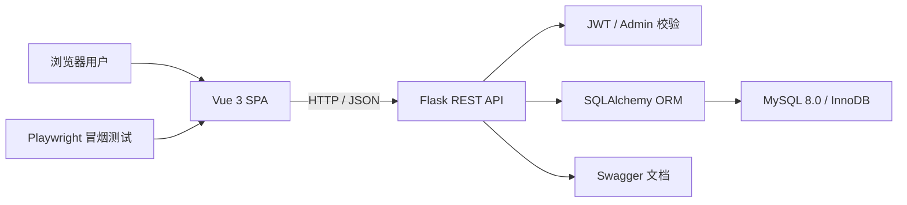
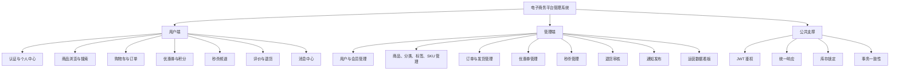
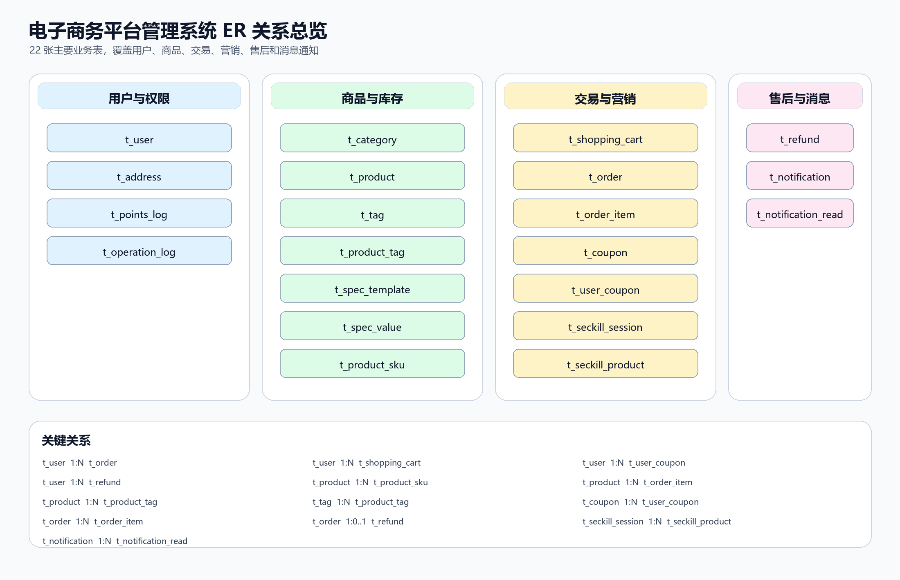

# 电子商务平台管理系统总体设计报告

> 基于当前 `dev` 分支代码、SQL 脚本与文档修订  
> 修订时间：2026-05-21

## 1. 文档说明

### 1.1 编写目的

本文档从整体层面说明电子商务平台管理系统的建设目标、业务边界、架构设计、模块划分、数据库设计、接口设计、部署方式和当前实现状态，为课程设计答辩、后续维护和功能扩展提供统一依据。

### 1.2 编写依据

- `db_require.md`
- `README.md`
- `docs/api_design.md`
- `docs/database_design.md`
- `docs/需求对比分析.md`
- `backend/app/*`
- `frontend/src/*`
- `sql/schema.sql`
- `sql/migrations/*`

### 1.3 修订原则

本文档以当前仓库实际代码和数据库脚本为准。早期文档中“管理员优惠券缺失”“仅 12 张核心表”“通知和售后仍处于规划”等表述已经过期，本次已按最新实现统一修订。

## 2. 项目概述

### 2.1 项目定位

本项目是一个基于 B/S 架构的电子商务平台管理系统，采用前后端分离方案，实现普通用户、VIP 用户和管理员三类角色协同，覆盖商品浏览、购物车、下单支付、优惠券、积分、评价、秒杀、消息通知、退货退款、后台管理和经营数据统计等场景。

### 2.2 建设目标

1. 完成商品浏览、购物车、下单、支付、发货、收货、评价的交易闭环。
2. 支持会员价、积分、优惠券、积分兑换、秒杀等营销能力。
3. 支持 SKU、多标签、分类、库存锁定和订单快照，保证交易数据一致性。
4. 支持退货退款、系统通知和个人消息，提高交易后服务能力。
5. 提供管理后台，覆盖用户、商品、订单、优惠券、退货、秒杀、通知和运营统计。
6. 通过关系数据库建模、事务控制、权限校验和索引设计体现数据库课程设计能力。

### 2.3 用户角色

| 角色 | 主要能力 |
|------|----------|
| 普通用户 | 注册登录、资料维护、地址管理、浏览商品、购物车、下单、余额支付、积分抵扣、领券、评价、退货申请、消息中心 |
| VIP 用户 | 在普通用户能力基础上享受会员价、等级折扣、积分倍率和会员权益 |
| 管理员 | 用户管理、商品管理、分类管理、标签/SKU 管理、订单发货、优惠券管理、退货审核、秒杀配置、通知发布、数据看板 |

## 3. 总体架构设计

### 3.1 架构风格

系统采用前后端分离三层结构：

| 层次 | 技术 | 职责 |
|------|------|------|
| 表现层 | Vue 3、Vue Router、Pinia、Element Plus | 页面展示、路由守卫、用户交互、状态管理 |
| 业务层 | Flask、SQLAlchemy、Flasgger | REST API、认证鉴权、业务编排、事务处理 |
| 数据层 | MySQL 8.0、InnoDB | 关系数据存储、索引、外键和事务一致性 |

### 3.2 总体架构图



### 3.3 代码组织

后端：

| 路径 | 说明 |
|------|------|
| `backend/app/__init__.py` | 应用工厂、蓝图注册、CORS、Swagger、健康检查、统一错误处理 |
| `backend/app/config.py` | 环境配置、数据库、JWT、VIP 套餐和会员权益 |
| `backend/app/models/models.py` | 22 张主要业务表对应的 SQLAlchemy 模型 |
| `backend/app/routes/*.py` | 按业务域拆分的接口和事务编排 |
| `backend/app/utils/helpers.py` | JWT、密码、分页、统一响应、管理员鉴权 |
| `backend/app/utils/validators.py` | 邮箱、手机号等输入校验 |
| `backend/app/utils/coupon_grant.py` | 新用户、满额订单等优惠券自动发放 |

前端：

| 路径 | 说明 |
|------|------|
| `frontend/src/router/index.js` | 用户端、后台路由、登录态恢复、管理员访问控制 |
| `frontend/src/api/index.js` | Axios 实例、Token 注入、错误处理和 API 封装 |
| `frontend/src/stores/user.js` | 用户会话、Token 和权限状态 |
| `frontend/src/views/*` | 用户端和管理端页面 |
| `frontend/tests/e2e/smoke.spec.js` | 前端冒烟测试 |

数据库脚本：

| 路径 | 说明 |
|------|------|
| `sql/schema.sql` | 全量表结构、约束和索引 |
| `sql/init_data.sql` | 初始化管理员、用户、分类、商品、优惠券、规格等样例数据 |
| `sql/migrations/*.sql` | 增量结构变更 |

## 4. 功能总体设计

### 4.1 功能结构



### 4.2 用户端模块

| 模块 | 主要设计 |
|------|----------|
| 认证与用户资料 | 用户注册、登录、退出、资料维护、头像上传 |
| 地址管理 | 地址列表、新增、编辑、删除、默认地址 |
| 商品浏览 | 分类、关键词、价格区间、销量/价格/新品/评分排序 |
| 商品标签 | 支持标签展示和按标签关键词搜索 |
| 商品规格 | 商品详情展示 SKU，购物车和订单保存 `sku_id` 与 `sku_text` |
| 购物车 | 支持多规格商品，唯一键为用户、商品、SKU |
| 订单 | 普通订单、积分抵扣、优惠券抵扣、余额支付、取消、确认收货 |
| 积分兑换 | 使用积分兑换指定商品，生成兑换订单和积分流水 |
| 秒杀频道 | 查询当前场次、活动商品、秒杀价、限购和活动库存 |
| 优惠券 | 可领取优惠券、我的优惠券、下单抵扣 |
| 评价 | 商品评价、我的评价、图片和匿名标识 |
| 退货退款 | 用户申请退货，查询退货记录 |
| 消息中心 | 公告、个人消息、未读数、单条已读、全部已读 |

### 4.3 管理端模块

| 模块 | 主要设计 |
|------|----------|
| 用户管理 | 用户列表、启用/禁用、VIP 状态和等级配置 |
| 商品管理 | 商品新增、编辑、下架、删除、SKU 维护、标签绑定 |
| 分类管理 | 多级分类维护 |
| 订单管理 | 订单列表、订单发货、物流单号 |
| 优惠券管理 | 优惠券创建、查询、更新、删除 |
| 退货管理 | 退货申请列表、审核通过或拒绝、备注 |
| 秒杀管理 | 场次创建与更新、秒杀商品配置、活动库存锁定和释放 |
| 通知管理 | 系统公告和个人消息发布 |
| 数据看板 | 销售总览、热销商品、销售趋势、商品排行、用户增长、订单来源 |

## 5. 数据库总体设计

### 5.1 主要实体

当前数据库包含 22 张主要业务表，覆盖用户、商品、交易、营销、售后和消息。

| 领域 | 表 |
|------|----|
| 用户 | `t_user`, `t_address`, `t_points_log`, `t_operation_log` |
| 商品 | `t_category`, `t_product`, `t_tag`, `t_product_tag`, `t_spec_template`, `t_spec_value`, `t_product_sku` |
| 交易 | `t_shopping_cart`, `t_order`, `t_order_item` |
| 营销 | `t_coupon`, `t_user_coupon`, `t_seckill_session`, `t_seckill_product` |
| 售后 | `t_refund` |
| 消息 | `t_notification`, `t_notification_read` |

### 5.2 ER 图



### 5.3 核心关系

| 关系 | 说明 |
|------|------|
| 用户与订单 | 一个用户可创建多个订单 |
| 订单与订单明细 | 一个订单包含多个商品快照 |
| 商品与 SKU | 一个商品可配置多个 SKU，SKU 具有独立库存和价格 |
| 商品与标签 | 商品和标签通过关联表形成多对多关系 |
| 用户与优惠券 | 用户领取优惠券后生成 `t_user_coupon` 实例 |
| 秒杀场次与商品 | 一个场次包含多个秒杀商品，可绑定商品 SKU |
| 订单与退货 | 一个订单可产生退货申请记录 |
| 通知与已读记录 | 公告使用用户维度已读表，个人消息直接记录 `is_read` |

### 5.4 库存一致性

系统使用真实库存和锁定库存共同表达可售数量：

```text
可用库存 = stock - locked_stock
```

普通订单创建后增加锁定库存，支付成功后扣减真实库存并释放锁定库存；取消订单释放锁定库存。秒杀活动配置时会先锁定活动库存，用户秒杀下单扣减活动池库存，支付或退款时再处理真实库存和锁定库存。

### 5.5 订单快照

订单创建时保存地址、商品名称、图片、成交价、数量、`sku_id` 和 `sku_text` 快照。这样即使后续商品改名、改价、下架或 SKU 调整，历史订单仍保持下单时状态。

## 6. 接口总体设计

接口统一以 `/api` 为前缀，采用 JSON 请求和响应。

| 业务域 | 主要接口 |
|--------|----------|
| 认证 | `/api/auth/register`, `/api/auth/login`, `/api/auth/logout` |
| 用户 | `/api/user/profile`, `/api/user/addresses`, `/api/user/points`, `/api/user/vip/*` |
| 商品 | `/api/products`, `/api/categories`, `/api/tags`, `/api/spec-templates`, `/api/products/{id}/skus` |
| 购物车 | `/api/cart` |
| 订单 | `/api/orders`, `/api/orders/{id}/pay`, `/api/orders/exchange`, `/api/orders/{id}/refund` |
| 优惠券 | `/api/coupons/available`, `/api/coupons/my`, `/api/coupons/{id}/receive` |
| 评价 | `/api/reviews`, `/api/reviews/product/{id}` |
| 秒杀 | `/api/seckill/current`, `/api/seckill/orders` |
| 通知 | `/api/notifications`, `/api/notifications/unread-count`, `/api/notifications/read-all` |
| 管理后台 | `/api/admin/users`, `/api/admin/products`, `/api/admin/orders`, `/api/admin/coupons`, `/api/admin/refunds`, `/api/admin/seckill/*`, `/api/admin/notifications`, `/api/admin/stats/*` |

## 7. 关键业务流程

### 7.1 普通订单流程

1. 用户将商品或指定 SKU 加入购物车。
2. 系统校验商品状态、SKU 状态和可用库存。
3. 用户创建订单，系统读取选中的购物车项。
4. 系统计算会员价、优惠券、积分抵扣和运费。
5. 系统创建订单和订单明细，并锁定商品或 SKU 库存。
6. 用户余额支付成功后，系统扣减真实库存、释放锁定库存、增加销量、发放积分。
7. 管理员发货，用户确认收货后订单完成。

### 7.2 秒杀流程

1. 管理员创建秒杀场次。
2. 管理员选择商品或 SKU，配置秒杀价、活动库存和限购数量。
3. 系统锁定对应商品或 SKU 库存。
4. 用户进入秒杀频道，查询当前有效场次。
5. 用户提交秒杀订单，系统锁定秒杀商品行，校验时间、库存、SKU 和限购。
6. 系统扣减活动池库存并创建支付方式为 `5` 的秒杀订单。
7. 后续支付、取消、退款复用订单库存恢复逻辑。

### 7.3 退货退款流程

1. 用户对符合条件的订单提交退货申请。
2. 订单状态进入退货申请中，系统记录 `t_refund`。
3. 管理员审核申请。
4. 审核通过后，系统退回余额、退还抵扣积分、扣回赠送积分、恢复库存、恢复优惠券状态并发送通知。
5. 审核拒绝后，系统恢复订单状态，写入驳回原因并发送通知。

### 7.4 通知流程

1. 管理员发布系统公告或个人消息，订单发货和退货审核也会生成个人消息。
2. 用户进入消息中心查询公告和个人消息。
3. 系统公告通过 `t_notification_read` 记录用户已读状态。
4. 个人消息通过 `t_notification.is_read` 记录已读状态。

## 8. 权限与安全设计

| 能力 | 设计 |
|------|------|
| 登录态 | JWT Bearer Token |
| 密码安全 | BCrypt 哈希 |
| 管理员权限 | `admin_required` 校验 `is_admin` |
| 用户数据隔离 | 用户侧接口以 `g.current_user_id` 查询和修改资源 |
| 输入校验 | 注册、登录、手机号、邮箱、库存、积分、时间等业务校验 |
| 错误处理 | 应用工厂统一处理 400、401、403、404、数据库错误和 500 |

## 9. 部署与运行

### 9.1 后端

```powershell
cd backend
pip install -r requirements.txt
python run.py
```

默认端口为 `5000`，健康检查接口：

| 接口 | 说明 |
|------|------|
| `/health` | 服务健康状态 |
| `/health/db` | 数据库连接状态 |

### 9.2 前端

```powershell
cd frontend
npm install
npm run serve
```

生产构建：

```powershell
cd frontend
npm run build
```

### 9.3 数据库初始化

```powershell
mysql -u root -p < sql/schema.sql
mysql -u root -p ecommerce_db < sql/init_data.sql
```

已有环境按 `sql/migrations` 顺序执行增量脚本。

## 10. 当前实现状态

已实现：

- 用户注册登录、个人中心、地址、余额、VIP、积分。
- 商品分类、商品管理、标签、规格模板、SKU。
- 购物车、普通订单、积分兑换订单、余额支付、库存锁定。
- 优惠券领取、使用和后台 CRUD。
- 商品评价。
- 秒杀场次、活动商品、活动库存、秒杀下单。
- 退货申请、退货审核、余额/积分/库存/优惠券恢复。
- 系统公告、个人消息、未读数和已读状态。
- 管理后台用户、商品、订单、优惠券、退货、秒杀、通知、统计。
- 前端 lint、生产构建和 Playwright 冒烟测试。

仍需完善：

- 第三方支付真实接入、回调验签、退款流水和对账。
- 短信验证码、第三方登录、地图服务等外部服务。
- `t_operation_log` 自动落库。
- 后端自动化测试覆盖，尤其是库存、秒杀、退货、通知等事务路径。
- 数据库迁移脚本的幂等化、版本管理和回滚策略。

## 11. 测试与验证

当前项目已具备基础验证手段：

| 类型 | 命令 | 说明 |
|------|------|------|
| 前端静态检查 | `npm run lint` | ESLint 检查 |
| 前端构建 | `npm run build` | 生产构建 |
| 前端冒烟测试 | `npm run test:e2e` | Playwright 测试核心页面 |
| 后端语法检查 | `python -m compileall backend/app` | Python 语法检查 |
| 后端测试 | `pytest -q` | 当前测试用例不足，需要补充 |

## 12. 后续优化建议

1. 为下单、支付、取消、秒杀、退货、通知补充后端单元测试和事务测试。
2. 增加操作日志中间件，覆盖管理员和用户敏感操作。
3. 新增支付流水、退款流水和对账模型，为真实支付接入准备。
4. 梳理 SQL 迁移脚本，使用版本化迁移工具管理数据库变更。
5. 扩展报表导出、第三方登录、短信验证码和地图地址能力。

## 13. 结论

当前系统已经从早期基础电商模型扩展为覆盖交易、营销、售后、通知和后台运营的综合管理系统。数据库层面已形成 22 张主要业务表，接口和前端页面也已覆盖 SKU、标签、秒杀、退货退款、消息通知和管理员优惠券 CRUD 等新增能力。后续工作重点应从“补齐功能”转向“增强测试、审计、支付流水和迁移治理”，以提升系统的可靠性和可维护性。
